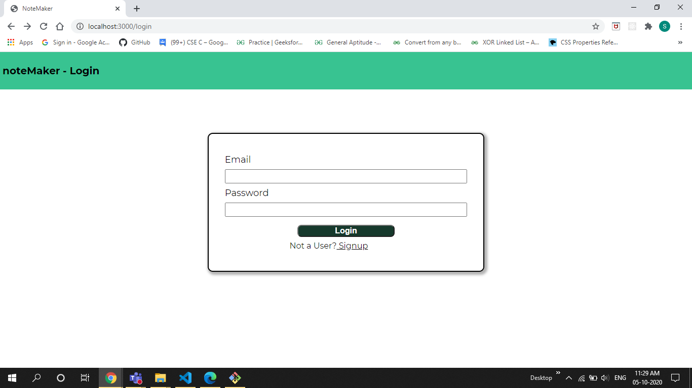
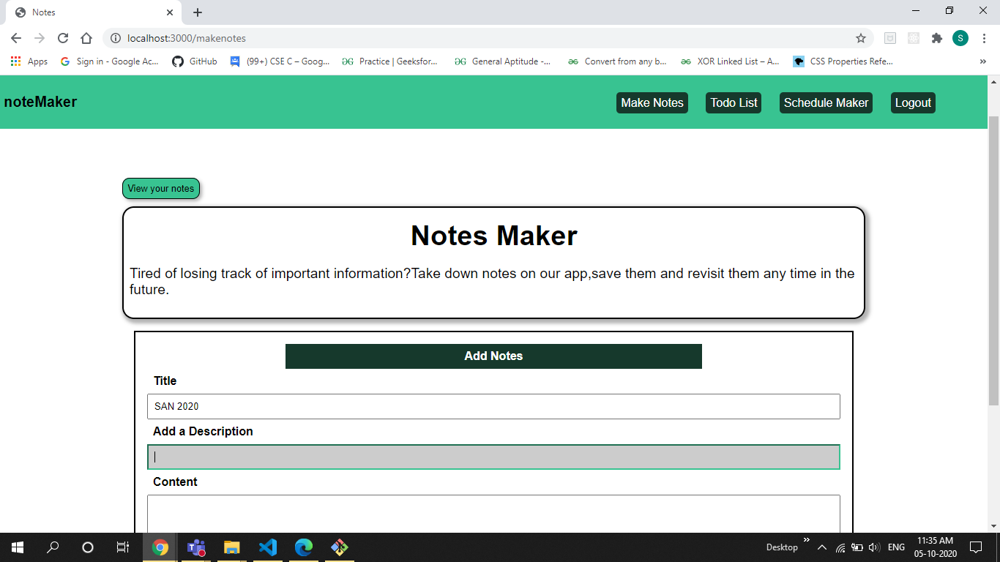
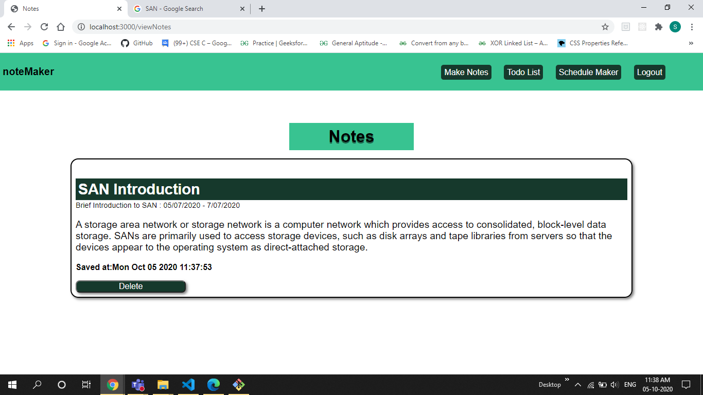
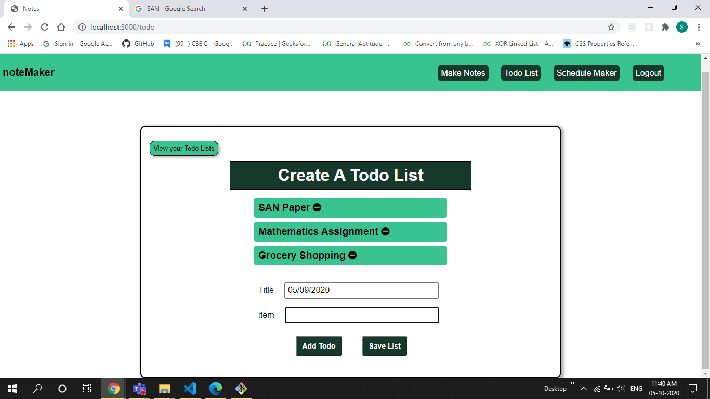
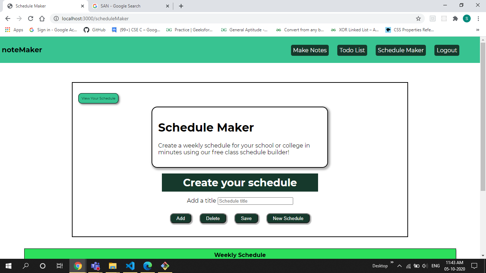
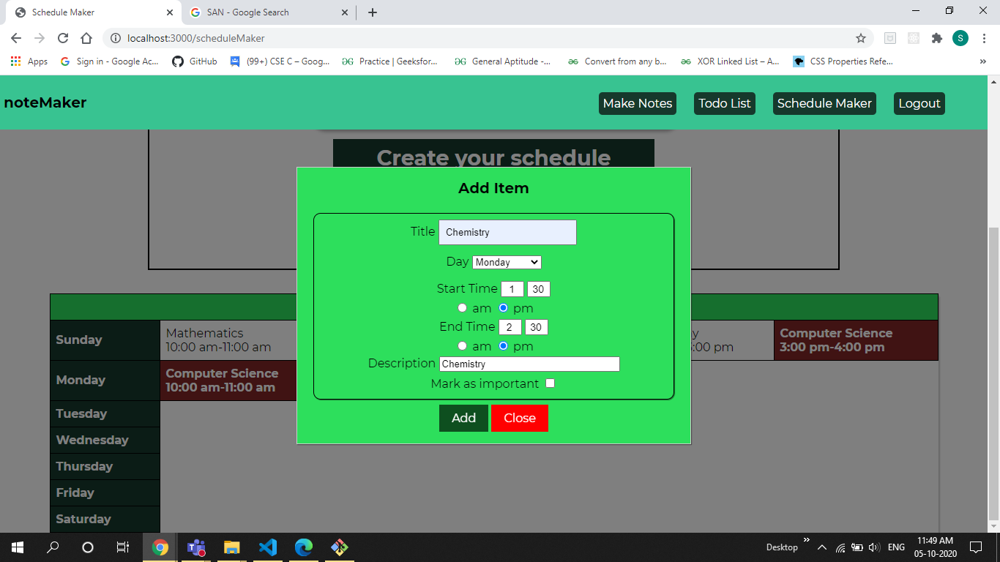
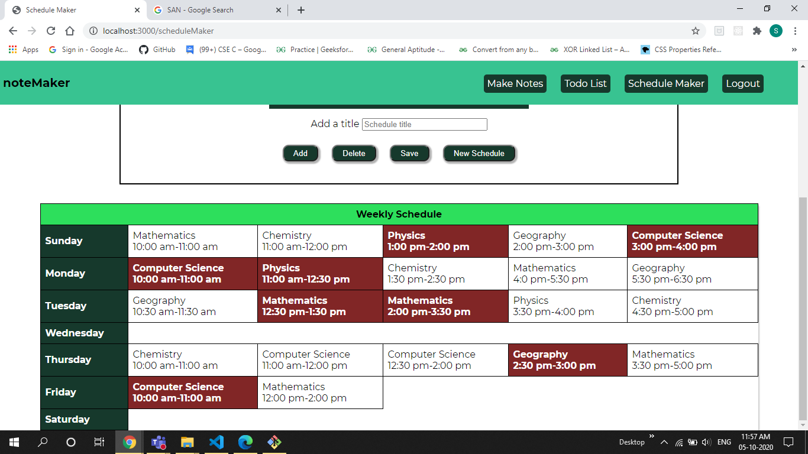

<h3>noteMaker</h3>

<h4>A <b>NodeJS</b> application which people can use to easily create notes, todo-lists and weekly schedules and save them for future reference</h4>

<h3>Start Screen</h3>

<h3>Authentication</h3>

<h3>Make Notes</h3>

<h3>View Saved Notes</h3>

<h3>Create Todo Lists</h3>

<h3>Schedule Maker</h3>

